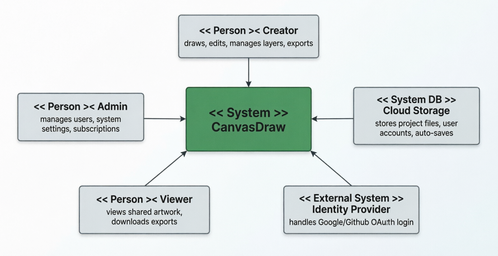

# 📄 SOFTWARE REQUIREMENTS SPECIFICATION (SRS) – CANVASDRAW
**Version:** 1.0 | **Date:** May 19, 2026  
**Audience:** Dev, QA, Product & Stakeholders  

---

## 1. OVERVIEW
**Purpose:** Define requirements for CanvasDraw, a zero-install web app for creating, editing, saving, and sharing digital art.  
**v1.0 Scope:** Core drawing tools, layer management, cloud/local persistence, multi-format export, and responsive cross-device support.  
**Target Users:** Casual creators, students/educators, hobbyist artists, professional designers.  

---

## 2. ENVIRONMENT & CONSTRAINTS
- **Browsers:** Chrome 110+, Firefox 115+, Safari 16+, Edge 110+
- **Devices:** Desktop, tablet, mobile (responsive ≥320px)
- **Input:** Mouse, multi-touch, stylus (pressure/tilt via Pointer Events)
- **Tech Stack:** HTML5 Canvas/WebGL, Web Workers, IndexedDB, Service Workers, REST API, OAuth2
- **Constraints:** Browser sandbox limits, 500 MB free storage cap, main-thread non-blocking rendering, GDPR/CCPA compliant. No native plugins required.

---

## 3. FUNCTIONAL REQUIREMENTS (Priority: High/Med/Low)
**🎨 Drawing & Tools (H)**
- Pencil, Brush, Eraser, Fill, Line, Rectangle, Ellipse, Polygon
- Brush controls: size, opacity, hardness, pressure, spacing
- Text tool: font, size, color, alignment, outline
- Zoom (10–400%), pan, rotate (0–360°)
- Undo/Redo (min 50 states)

**📑 Layers & Workspace (H)**
- Add, delete, rename, reorder, visibility/lock toggles
- Blend modes & per-layer opacity

**💾 Save, Sync & Export (H)**
- Cloud auto-save every 30s (when online)
- Local offline cache via IndexedDB; auto-sync on reconnect
- Export: PNG, JPEG, SVG, WebP, PDF (user-defined DPI/resolution)

**🔐 Auth & UI (H/M)**
- Login: Email/password, Google/GitHub OAuth, magic links
- Responsive, touch-optimized UI
- Full keyboard shortcut support for primary actions

---

# NON-FUNCTIONAL REQUIREMENTS
| Area | Target |
|------|--------|
| **Performance** | ≤30ms input latency; ≥60 FPS desktop / ≥30 FPS tablet |
| **Reliability** | 99.5% backend uptime |
| **Security** | TLS 1.3 in transit, AES-256 at rest, GDPR/CCPA compliant |
| **Accessibility** | WCAG 2.2 AA (keyboard nav, ARIA, high contrast, screen readers) |
| **Scalability** | 10k concurrent users, <2s API response |
| **Storage** | ≤5 MB per 1080p/10-layer project |
| **Offline** | Graceful degradation + queued sync on reconnect |
| **Cross-Browser** | Feature parity across all supported browsers |

---

## 4. Context diagram:

## 5. RELEASE ROADMAP
- **v1.0 (Current):** Canvas engine, toolset, layers, save/export, auth, responsive UI
- **v2.0:** Real-time collaboration (WebSockets, CRDT/OT, presence indicators)
- **v3.0:** AI assist (sketch cleanup, auto-vectorize, style transfer), plugin ecosystem

---

## 6. VALIDATION & OPEN DECISIONS
- All requirements map to QA test cases, CI/CD performance budgets, and accessibility audits (axe-core).
- **Pending Review:**
  1. v1.0 vector/raster hybrid rendering vs. raster-only + SVG export?
  2. WebGPU vs WebGL2 for next-gen rendering (WebGPU ~85% support in 2026)?
  3. Free storage tier: 500 MB vs 1 GB?

*Scope changes require formal approval. This document serves as the single source of truth for sprint planning, architecture, and QA validation.*
